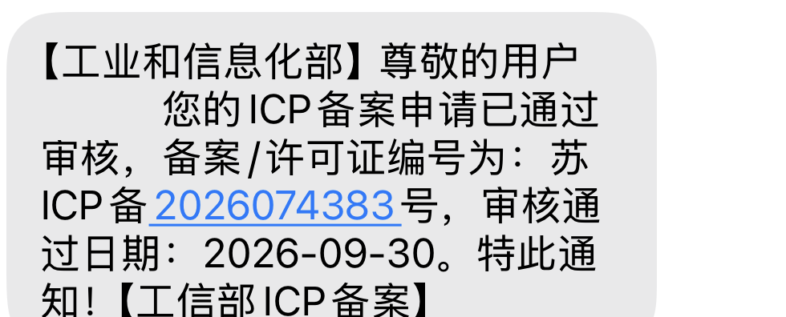
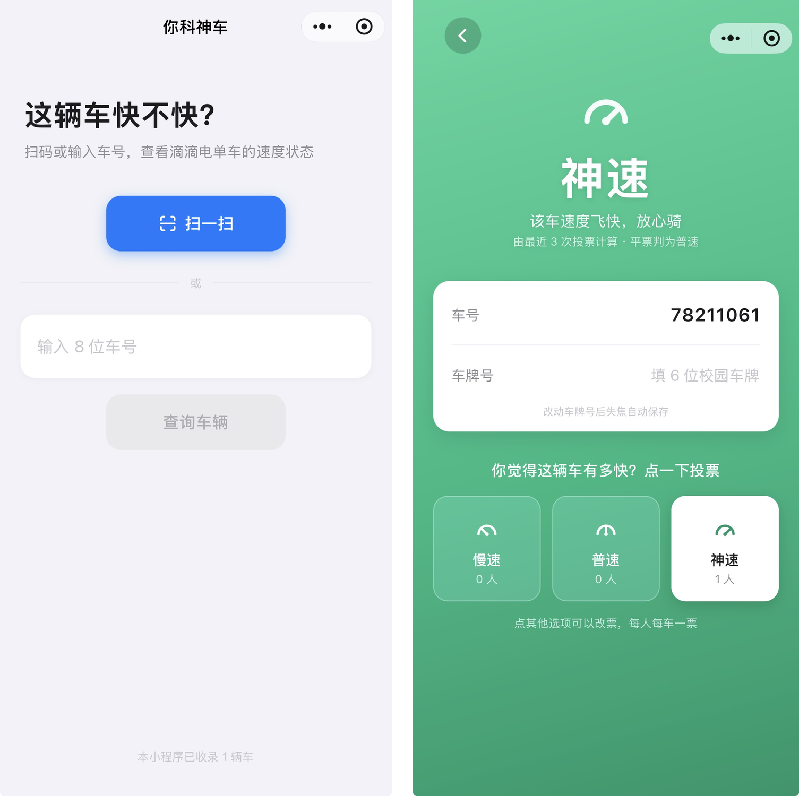

# 你科神车

<div align="center">

&nbsp;&nbsp;&nbsp;&nbsp;

微信小程序码（左）· 普通二维码（右）—— 微信扫一扫即可使用

</div>

> ✅ **小程序已通过工信部 ICP 备案**（备案号：苏ICP备2026074383号，2026-09-30 通过，v1.0.0）。
>
> ℹ️ 由于尚未完成微信官方认证，小程序**暂时无法在微信内被搜索到**，请使用上方任意二维码扫码进入。
>
> 
>
> <sub>工信部备案通过通知（个人信息已作遮挡处理）</sub>

标记和查询校园滴滴共享电单车速度状态的微信小程序，基于微信云开发 2.0（SQL 型数据库 PostgreSQL）。

> 本项目仅在**南方科技大学**校园内部使用，用于辨别校内滴滴共享电单车中被限速的"慢车"。
>
> **未来可能更新**
> 1. **一键跳转开车**：在车辆信息页新增跳转入口，识别车辆后可直接唤起滴滴青桔小程序，快速进入开锁流程。
> 2. **车辆列表**：新增已收录车辆的列表页，集中展示各车辆的车号与当前速度状态，方便按需查找。
> 3. **快车位置查询**（可行性待验证）：初步思路是，记录快车后通过"扫码开车、立即锁车"获得一段极短的骑行记录，借助滴滴生成的骑行轨迹定位该车在校园内的停放位置，供其他用户就近查找。

## 界面预览

<div align="center">

</div>

## 功能

- **主页**：扫码（解析滴滴二维码中的 `vehicleId` 参数）或输入 8 位车号进入车辆信息页
- **车辆信息页**：
  - 三色渐变背景对应速度状态：慢速 = 红、普速 = 黄、神速 = 绿
  - 顶部大字显示当前速度状态，由最近 3 次投票计算
  - 车号只读；车牌号（6 位数字）扫码进入可编辑，失焦自动保存并留修改记录
  - 三个投票按钮（慢速 / 普速 / 神速），按钮下方实时显示各选项人数
- **计票规则**：取最新 3 票，最高票唯一则取之；任何平票判为普速；无投票默认普速
- **权限分层**：扫码进入（证明人在车旁）可投票、可编辑车牌；手动输入车号仅可查看
- **一人一车一票**：重复投票即改票，云端以 `vehicle_id + openid` 唯一约束保证

## 结构

```
miniprogram/
  pages/index/    主页（扫码 + 车号输入）
  pages/detail/   车辆信息页（渐变状态页 + 投票）
  utils/cloud.js  云函数调用与二维码解析封装
cloudfunctions/
  bike/           唯一云函数，按 type 分发：ensureVehicle / getVehicle / vote / updatePlate
```

## 数据表（public schema）

- `vehicles`：`vehicle_id`（主键）、`plate`、`created_at`
- `votes`：`vehicle_id` + `openid`（联合唯一）、`choice`（slow/normal/fast）、`updated_at`
- `plate_logs`：车牌修改流水（旧值、新值、修改人）

## 本地开发

1. `miniprogram/app.js` 中已配置云环境 ID，如需更换在此修改
2. 云函数部署（需开启开发者工具服务端口）：
   ```
   cli cloud functions deploy --e <环境ID> --n bike --r --project <项目路径>
   ```
3. 数据表已在线上建好；如需重建，建表与授权 SQL 见 git 历史
